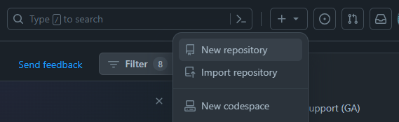
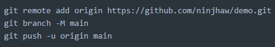

# DATA ENGINEERING PROJECT 🖥️

## Prerequisites in this Project
- Download and Install [Python](https://www.python.org/downloads/)
- Download and Install [Git](https://git-scm.com/downloads)
- Download and Install [Postgresql](https://www.postgresql.org/download/)
- Download and Install [SQL Server 2022 Developer Edition](https://www.microsoft.com/en-us/sql-server/sql-server-downloads)
- Download and Install [Visual Studio](https://visualstudio.microsoft.com/downloads/)
- Download and Install [PowerBI Desktop](https://powerbi.microsoft.com/en-us/downloads/) or in Microsoft Store 

## A. Connecting Local and Remote Repositories
### In your Local Machine
1. Create a folder in your local machine 
```bash
mkdir <folder_name>
```
2. Change directory to the created folder
```bash
cd <folder_name>
```
3. Initialize git
```bash
git init .
```
If you don't have git yet, you can download [here](https://github.com/ninjhaw/DE_Project?tab=readme-ov-file#prerequisites-in-this-project)  
4. Now you can create some files inside your folder. For example, README.md and put some text in it.  
  <br>
5. Add file to the staging area by typing the command in the VSCode terminal:
```bash
git add README.md
```
Note: You can specify a file to add. However, you can use `.` to add all files in the folder.  
6. Commit the changes you've made by typing the command in the VSCode terminal:  
```bash
git commit -m "Your commit message here"
```
7. Push file to git
```bash
git push
```
### In Github repository
1. Go to [github](https://github.com)
2. Navigate to the top right corner, click `+` and choose `New Repository`
  
3. Put a repository name
4. Select Public and Create repository
5. Generate your SSH Key [here](https://docs.github.com/en/authentication/connecting-to-github-with-ssh/generating-a-new-ssh-key-and-adding-it-to-the-ssh-agent?fbclid=IwAR2z7JJtyg304j8Awvd6i60FIaopo7tuQsqXHMbziOMYfZwmIDexVZe_Y8k)  
6. After generating the ssh key, go back to terminal and copy the first line of code below:
  
7. Create branch main, copy the second line of code
8. Finally, push the changes to main branch

## Success! You push an existing repository to Github
- For Git Cheat Sheet, you can view [here](cheat_sheet/git_commands.md)  

## B. Setting Up Virtual Environment in Python
1. Open the repository in Visual Studio Code (VSCode).<br>
    Ensure that you are in the correct directory where your repository is located.

2. Press Ctrl + ~ to open the terminal.  
    Enter the command:  

    ```bash
    python -m venv <environment_name>
    ```  

    Replace ```<environment_name>``` with the name you want. 
    Take note that a folder will be added with the name of the environment you created. 

3. Activate the virtual environment:  
    a. On Windows command prompt: 

    ```bash
    env\Scripts\activate.bat
    ```
    b. On Windows PowerShell:  

    ```bash
    env\Scripts\Activate.ps1
    ```
    c. On Linux/Unix:  

    ```bash
    source env/bin/activate
    ```

4. Observe that the environment name (<your_environment_name>) appears on the left side before the command prompt.
5. You can now install packages listed in your requirements.txt file. 

    ```bash
    pip install -r requirements.txt
    ```

### Join our community: <br> 
Discord: [Data Engineering Pilipinas](https://discord.gg/H8fuv5DF),
         [DataCamp](https://discord.gg/UUWAEQQ6)<br>
FB Group: [Data Engineering Pilipinas](https://www.facebook.com/groups/dataengineeringpilipinas/)<br>
Follow: [Josh Dev](https://www.facebook.com/profile.php?id=100087019650476)<br>
You may also visit Data Engineering Website [here](https://dataengineering.ph/)